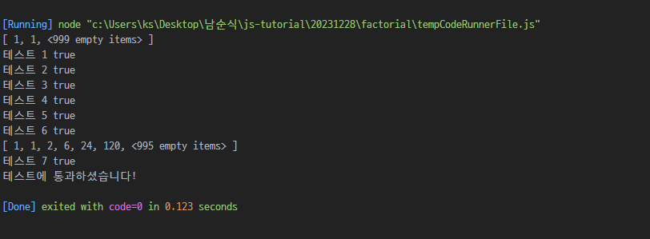

# 팩토리얼

# dp 방식 풀이 미리보기

- n의 범위만큼 dp array 생성 

``` javascript
let dp = new Array(1001);
dp[0] = 1;
dp[1] = 1;

function question(n) {
    // 여기에서 코드 작성해주세요!
    if (dp[n]) return dp[n];

    for (let i = 2; i <= n; i++) {
        if (dp[i]) continue;
        dp[i] = dp[i - 1] * i; 
    }
    
    return dp[n];
}
```

- 미리보기



- node.js는

```
[ 1, 1, 2, 6, 24, 120, <995 empty items> ]
```

과같이 표현해준다..