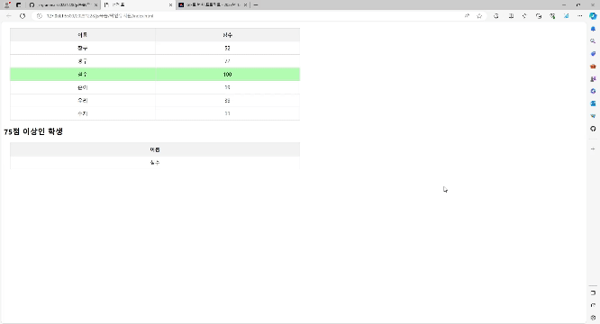

# 떡잎유치원 성적표

# 미리보기

- lambda를 활용한 성적 순 정렬

``` javascript
const scoreTableBody = document.getElementById('scoreTableBody');
const passTableBody = document.getElementById('passTableBody');

students.forEach(student => {
    const row = document.createElement('tr');
    row.innerHTML = `<td>${student.name}</td><td>${student.score}</td>`;
    
    let result = [];
    if (student.score > 75) {
        result.push([student.name, student.score]); //result_list 에 이름과 성적을 추가
    }
    result.sort((x, y) => y[1] - x[1]); // result_list원소의 성적으로 내림차순 정렬

    result.forEach(s => {
        row.classList.add('pass');
        const passRow = document.createElement('tr');
        passRow.innerHTML = `<td>${s[0]}</td>`;
        passTableBody.appendChild(passRow);
    })

    scoreTableBody.appendChild(row);
});
```

- vedio

